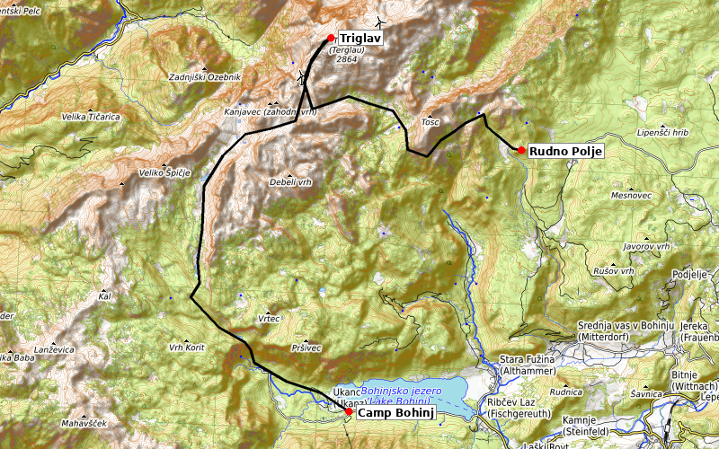

# Static Map MCP Server

An MCP server that renders routes and markers on OpenStreetMap tiles and save as PNG.

[](LICENSE)
[](https://www.python.org/downloads/)



## Quick Start

Add to your MCP config:

```json
{
  "mcpServers": {
    "staticmap": {
      "command": "uvx",
      "args": ["staticmap-mcp"]
    }
  }
}
```

> [!NOTE]
> No API key required. Uses public OpenStreetMap tiles.

> [!TIP]
> Pair with [openroute-mcp](https://github.com/vemonet/openroute-mcp) to generate route coordinates from natural language prompts, then pass them to staticmap-mcp to render the map.

## Available Tools

| Tool | Description |
|------|-------------|
| `render_route_map` | Render a route on an OpenStreetMap tile map and save as PNG |

<details>
<summary>Full tool reference</summary>

### render_route_map

Render a route on an OpenStreetMap tile map and save as PNG.

- `coordinates` (list of [lon, lat], required): Route as list of [longitude, latitude] pairs, e.g. `[[-17.1, 28.1], [-17.2, 28.2]]`
- `output_path` (string, required): File path to save the PNG image (parent directories created automatically)
- `markers` (list of objects): Optional named points, each with `lon`, `lat`, and `label` keys
- `width` (int): Image width in pixels (default: 800)
- `height` (int): Image height in pixels (default: 600)
- `line_color` (string): Route line colour (default: "black")
- `line_width` (int): Route line width in pixels (default: 3)
- `basemap` (string): Map tile style — `"osm"` (default), `"topo"` (terrain/hiking), `"cycle"` (cycling), `"humanitarian"`

</details>

## Development

```bash
git clone https://github.com/cvsouth/staticmap-mcp.git
cd staticmap-mcp
uv sync --dev
pytest
```

## License

MIT
